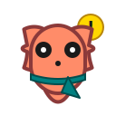

# 🦞 Clawster

A cute animated lobster desktop pet powered by [OpenClaw](https://openclaw.ai). Clawster lives on your screen, watches what you're working on, and helps you out with quick chat interactions.

https://www.youtube.com/watch?v=geXxvEi9g9o


## Animations

Clawster has expressive animations for every mood:

| Idle | Happy | Sleep | Startle |
|:----:|:-----:|:-----:|:-------:|
|  |  |  |  |
| Breathing & blinking | Bouncing with joy | Zzz... | Surprised! |

| Doze | Side-Eye | Crossed | Huff |
|:----:|:--------:|:-------:|:----:|
|  |  |  |  |
| Getting sleepy... | Judging you | Arms crossed | Steaming mad |

| Proud | Peek | Spin | Walking |
|:-----:|:----:|:----:|:-------:|
|  |  |  |  |
| Feeling accomplished | Curious peek | Celebratory spin | Scuttling around |

## Features

- **Animated Desktop Pet** — A friendly lobster that lives on your screen with multiple moods and idle animations
- **Quick Chat** — Press `Cmd+Shift+Space` to summon a chat bar and ask Clawster anything
- **Screen Awareness** — Clawster can see what app you're using and offer contextual help
- **Screenshot Questions** — Press `Cmd+Shift+/` to capture your screen and ask questions about it
- **Attention Seeking** — Clawster occasionally scuttles toward your cursor when feeling lonely
- **Idle Behaviors** — Watch Clawster blink, yawn, stretch, and look around when idle
- **Poke Reactions** — Click on Clawster for fun reactions, double-click to open the full assistant panel

## Screenshots

| Chat Popup | Quick Chat Bar | Assistant Panel |
|:----------:|:--------------:|:---------------:|
|  |  |  |
| Clawster pops up with helpful tips and quick replies | Press `Cmd+Shift+Space` to chat anywhere | Full assistant panel for longer conversations |

## Prerequisites

- **Node.js** 18+
- **OpenClaw** — Install and set up [OpenClaw](https://openclaw.ai) with the gateway running locally

## Installation

1. **Clone the repository**
   ```bash
   git clone https://github.com/wuyuwenj/clawster.git
   cd clawster
   ```

2. **Install dependencies**
   ```bash
   npm install
   ```

3. **Set up Clawster's personality in OpenClaw**
   ```bash
   cp openclaw/IDENTITY.md openclaw/SOUL.md ~/.openclaw/workspace/
   openclaw gateway restart
   ```

4. **Configure the gateway token**

   Get your OpenClaw gateway token:
   ```bash
   grep "token" ~/.openclaw/openclaw.json
   ```

   Launch Clawster, click on the lobster to open the Assistant panel, go to Settings, and enter:
   - Server URL: `http://localhost:18789`
   - Gateway Token: (paste your token)

5. **Run the app**
   ```bash
   npm run dev
   ```

## Keyboard Shortcuts

| Shortcut | Action |
|----------|--------|
| `Cmd+Shift+Space` | Open quick chat bar |
| `Cmd+Shift+/` | Screenshot + question |
| `Alt+Space` | Toggle full assistant panel |
| `Esc` | Close chat bar |

## Development

```bash
# Run in development mode
npm run dev

# Build for production
npm run build

# Create distributable package
npm run dist
```

## Project Structure

```
clawster/
├── src/
│   ├── main/           # Electron main process
│   │   ├── main.ts     # App entry, windows, IPC handlers
│   │   ├── clawbot-client.ts  # OpenClaw API client
│   │   ├── watchers.ts # App/file activity watchers
│   │   └── store.ts    # Persistent settings
│   └── renderer/       # Frontend (React + Vite)
│       ├── pet/        # Animated lobster component
│       ├── chatbar/    # Quick chat overlay
│       └── assistant/  # Full assistant panel
├── openclaw/           # Identity files for OpenClaw
└── package.json
```

## How It Works

Clawster is an Electron app that connects to your local OpenClaw gateway. When you chat with Clawster:

1. Your message is sent to OpenClaw's chat completions API
2. OpenClaw uses the IDENTITY.md and SOUL.md files to respond as Clawster
3. Clawster can include action commands in responses to move, change mood, etc.
4. The desktop pet animates based on these actions

## Customization

### Personality
Edit `~/.openclaw/workspace/IDENTITY.md` and `SOUL.md` to customize Clawster's personality.

### Behaviors
In the Assistant panel settings, you can:
- Enable/disable attention seeking behavior
- Configure watched folders for file change notifications
- Toggle window title tracking

## License

MIT

---

_Made with 🦞 and OpenClaw_
