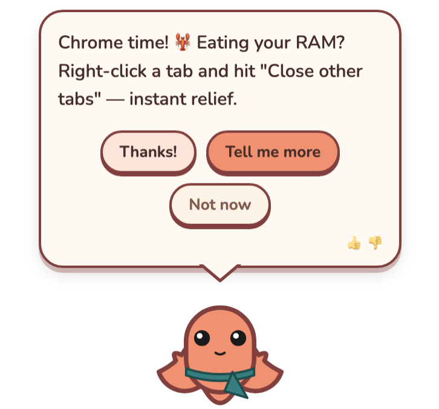
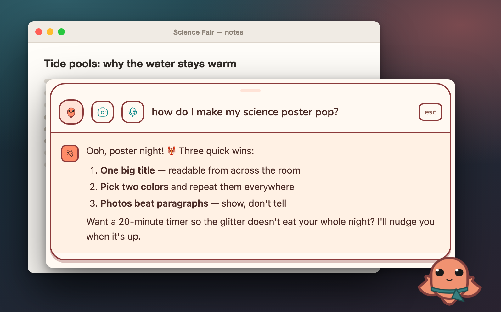
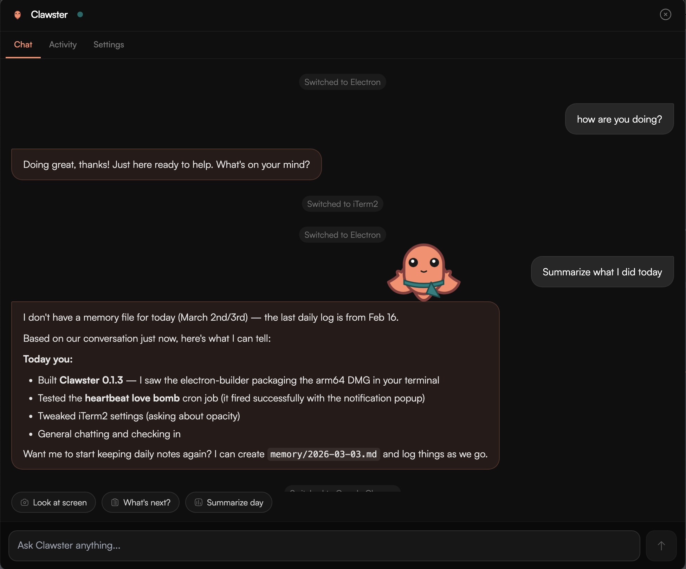

# Clawster — AI Desktop Pet for macOS

**Clawster is a free, open-source AI desktop pet powered by [OpenClaw](https://openclaw.ai).** It's a screen-aware AI companion for macOS — a cute animated lobster that lives on your desktop, watches what you're doing, and helps you get things done.

Clawster is the first AI pet and desktop pet built on OpenClaw. All AI processing runs locally on your machine. No cloud, no API keys, no data leaves your computer.

**[Website](https://clawster.pet)** · **[Download for Mac](https://github.com/wuyuwenj/clawster/releases/download/v0.1.3/Clawster-0.1.3-arm64.dmg)**

  

https://github.com/wuyuwenj/clawster/raw/main/assets/demo.mp4

## What is Clawster?

Clawster is an AI desktop pet that sits on your macOS screen as an animated lobster. Unlike traditional virtual pets, this desktop pet is powered by OpenClaw and can actually help you — it watches your screen, answers questions, analyzes screenshots, and provides context-aware assistance for any app or website.

**Key highlights:**
- **AI desktop pet** that lives on your screen with 12 animated moods
- **Screen-aware AI companion** — knows what app you're using
- **Desktop pet powered by OpenClaw** — all AI runs locally, fully private
- **Not just for developers** — helps with any app, website, or task
- Won **2nd Place at the humans& hackathon**

## Features

| Feature | Description | Shortcut |
|---------|-------------|----------|
| **Quick Chat** | Summon Clawster anywhere for context-aware help | `Cmd+Shift+Space` |
| **Screenshot Questions** | Snap any part of your screen and ask about it | `Cmd+Shift+/` |
| **Full Assistant Panel** | Open the full assistant for longer conversations | `Cmd+Shift+A` or right-click pet |
| **12 Animated Moods** | Expressive animations that react to interactions | — |
| **Screen Awareness** | Detects your active app and window for contextual help | — |
| **Customizable Personality** | Edit IDENTITY.md and SOUL.md to shape behavior | — |
| **Attention Seeking** | Scuttles toward your cursor when feeling lonely | — |
| **Guided Onboarding** | 8-step wizard, no terminal required | — |

## Animations

This AI desktop pet expresses itself through 12 animated moods:

| Idle | Happy | Sleep | Startle |
|:----:|:-----:|:-----:|:-------:|
|  |  |  |  |
| Breathing & blinking | Bouncing with joy | Zzz... | Surprised! |

| Doze | Side-Eye | Crossed | Huff |
|:----:|:--------:|:-------:|:----:|
|  |  |  |  |
| Getting sleepy... | Judging you | Arms crossed | Steaming mad |

| Proud | Peek | Spin | Walking |
|:-----:|:----:|:----:|:-------:|
|  |  |  |  |
| Feeling accomplished | Curious peek | Celebratory spin | Scuttling around |

## Screenshots

| Chat Popup | Quick Chat Bar | Assistant Panel |
|:----------:|:--------------:|:---------------:|
|  |  |  |
| Clawster pops up with contextual tips | Press `Cmd+Shift+Space` to chat anywhere | Right-click the pet for the full assistant |

## Download

**For most users:** Download the app directly — no terminal needed.

**[Download Clawster for Mac (Apple Silicon)](https://github.com/wuyuwenj/clawster/releases/download/v0.1.3/Clawster-0.1.3-arm64.dmg)**

Open the DMG, drag Clawster to Applications, and launch. The 8-step onboarding wizard guides you through everything.

## Getting Started (from source)

### Prerequisites

- **Node.js** 18+
- **[OpenClaw](https://openclaw.ai)** — local AI gateway running on your machine

### Installation

```bash
git clone https://github.com/wuyuwenj/clawster.git
cd clawster
npm install
npm run dev
```

On first launch, the onboarding wizard walks you through setup.

## Onboarding Wizard

Clawster includes a guided 8-step onboarding wizard — no terminal or command line required:

1. **Welcome** — Introduction to Clawster and its capabilities
2. **Workspace Selection** — Use your existing OpenClaw workspace or create a dedicated Clawster workspace
3. **Memory Migration** — Optionally bring over conversations from an existing workspace
4. **Connection Setup** — Auto-detects your OpenClaw gateway from `~/.openclaw/openclaw.json`
5. **Personality** — Customize IDENTITY.md (who Clawster is) and SOUL.md (how it behaves)
6. **Watch Preferences** — Configure screen awareness and privacy settings
7. **Hotkeys** — Set custom keyboard shortcuts
8. **Complete** — Review settings and launch

## How It Works

Clawster is an AI desktop pet built on OpenClaw. Here's how the architecture works:

1. Clawster sends your message to the local OpenClaw gateway (`http://127.0.0.1:18789`)
2. OpenClaw processes the request using IDENTITY.md and SOUL.md to respond as Clawster
3. Responses can include action commands (move, change mood, wave, snip)
4. The desktop pet animates based on these actions

**Everything runs locally.** No API keys, no cloud accounts, no data leaves your machine. This AI pet is powered entirely by OpenClaw on your local machine.

## Customization

### Personality
Edit the files in your workspace to customize this AI desktop pet:
- **IDENTITY.md** — Define who Clawster is: name, appearance, available actions
- **SOUL.md** — Define how Clawster behaves: tone, response style, personality traits

Make it a strict code reviewer, a cheerful assistant, a sarcastic debugger, or anything you want.

### Behaviors
In the Assistant panel settings, you can:
- Enable/disable attention seeking behavior
- Configure watched folders for file change notifications
- Toggle window title tracking

### Reset Onboarding
```bash
rm ~/Library/Application\ Support/clawster/clawster-config.json
```

## Privacy

Clawster is an AI desktop pet designed with privacy as a core principle:
- All AI processing happens locally through OpenClaw
- Screen captures are processed on-device and never uploaded
- Conversations are stored locally in your workspace directory
- No analytics, telemetry, or tracking
- No cloud component

## Development

```bash
npm run dev      # Run in development mode
npm run build    # Build for production
npm run dist     # Create distributable package
```

### Project Structure

```
clawster/
├── src/
│   ├── main/           # Electron main process
│   │   ├── main.ts     # App entry, windows, IPC handlers
│   │   ├── clawbot-client.ts  # OpenClaw API client
│   │   ├── watchers.ts # App/file activity watchers
│   │   └── store.ts    # Persistent settings
│   └── renderer/       # Frontend (React + Vite)
│       ├── pet/        # Animated lobster component
│       ├── chatbar/    # Quick chat overlay
│       ├── assistant/  # Full assistant panel
│       └── onboarding/ # First-launch setup wizard
├── openclaw/           # Default personality files
└── package.json
```

## System Requirements

- **macOS** (Monterey 12.0 or later)
- **Apple Silicon** (arm64) or **Intel** (x86_64)
- **OpenClaw** installed locally

## Links

- **Website:** [clawster.pet](https://clawster.pet)
- **OpenClaw:** [openclaw.ai](https://openclaw.ai)
- **Download:** [Latest Release](https://github.com/wuyuwenj/clawster/releases/latest)

## License

MIT

---

Clawster is a free, open-source AI desktop pet powered by OpenClaw for macOS. The first desktop pet built on OpenClaw.

_Made with 🦞 and [OpenClaw](https://openclaw.ai)_
